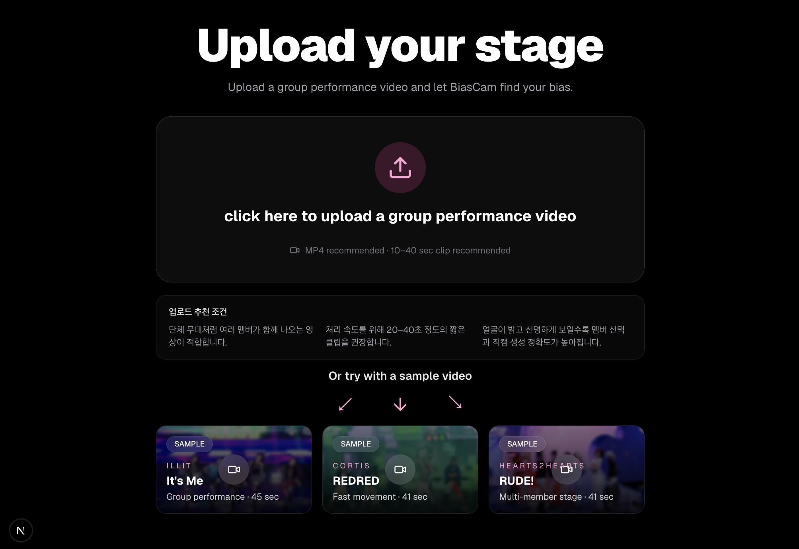
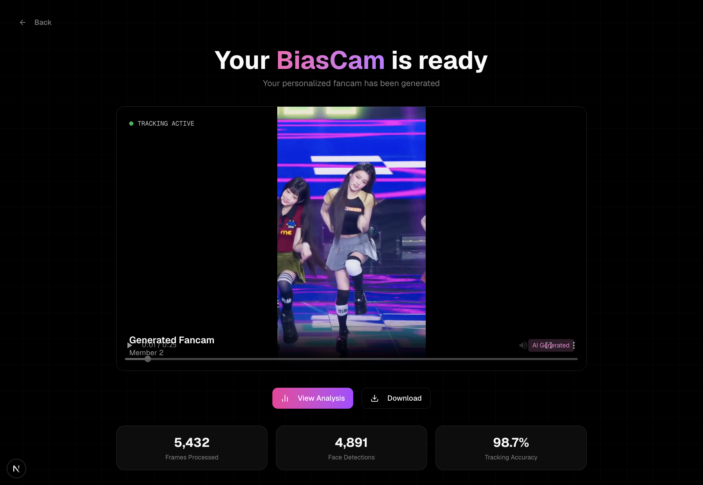
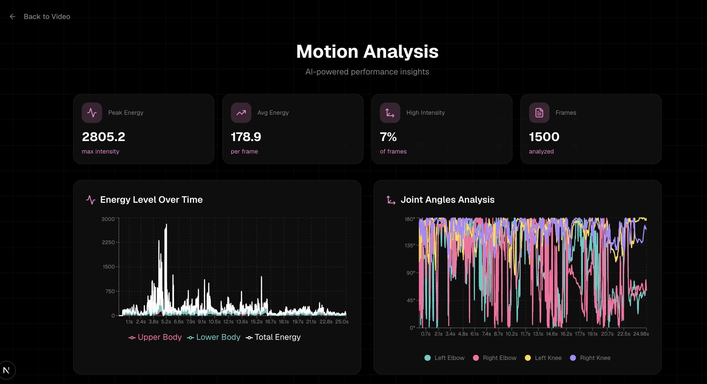
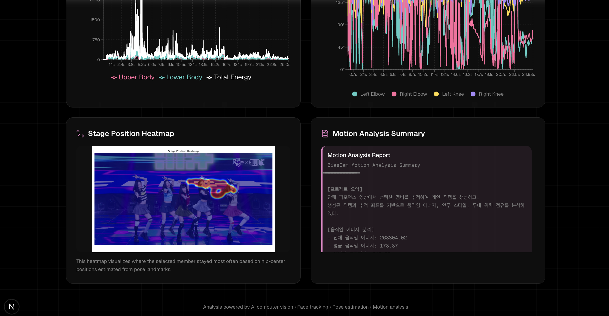

# BiasCam

BiasCam은 단체 퍼포먼스 영상에서 사용자가 선택한 멤버를 자동으로 추적하여 개인 직캠을 생성하고, 생성된 직캠을 기반으로 움직임 분석 결과를 제공하는 AI 기반 웹 서비스입니다.

사용자는 직접 영상을 업로드하거나 제공된 샘플 영상을 선택할 수 있으며, 얼굴 후보 중 원하는 멤버를 선택하면 해당 멤버 중심의 개인 직캠이 생성됩니다. 이후 에너지 변화, 상체/하체 움직임, 무대 위치 히트맵, 모션 분석 리포트를 통해 퍼포먼스 특징을 확인할 수 있습니다.

---

## 주요 기능

### 1. 영상 업로드 및 샘플 영상 선택



- 사용자가 단체 무대 영상을 직접 업로드할 수 있습니다.
- 또는 제공된 샘플 영상 3개 중 하나를 선택하여 테스트할 수 있습니다.

### 2. 얼굴 후보 탐지 및 멤버 선택


- 업로드된 영상에서 일정 간격으로 여러 프레임을 샘플링합니다.
- InsightFace를 이용해 프레임 내 얼굴을 검출하고 얼굴 임베딩을 추출합니다.
- 얼굴 후보의 선명도, 크기, 신뢰도 등을 기준으로 점수를 계산합니다.
- 얼굴 임베딩 기반 DBSCAN 클러스터링을 통해 유사한 얼굴을 묶어 멤버 후보를 생성합니다.
- 같은 멤버가 여러 후보로 표시될 수 있으므로, 사용자는 가장 선명하고 정면에 가까운 얼굴을 선택합니다.

### 3. 개인 직캠 생성



- 사용자가 선택한 얼굴 후보를 기준으로 reference embedding을 생성합니다.
- InsightFace로 각 프레임의 얼굴을 검출하고, 얼굴 임베딩 유사도를 비교해 선택 멤버를 추적합니다.
- bbox 위치 정보와 smoothing을 활용하여 화면이 급격히 흔들리지 않도록 crop 영역을 조정합니다.
- 추적 결과를 기반으로 세로형 개인 직캠 영상을 생성합니다.
- 생성된 직캠은 결과 페이지에서 재생할 수 있으며, 다운로드할 수 있습니다.

### 4. 모션 분석 결과 제공




직캠 생성 후 다음 분석 결과를 제공합니다.

- Movement Energy Breakdown  
  MediaPipe Pose로 추정한 관절 좌표를 기반으로 상체, 하체, 전체 움직임 에너지를 계산하고 시간에 따라 시각화합니다.

- Energy Intensity Graph  
  전체 움직임 에너지를 평균 및 표준편차 기준으로 저강도, 중강도, 고강도 구간으로 구분하여 표시하고, 에너지가 가장 높은 시점을 킬링파트 후보로 표시합니다.

- Joint Angles Analysis  
  팔꿈치와 무릎 관절 각도 변화를 시간에 따라 시각화하여 안무 동작의 변화 흐름을 확인할 수 있습니다.

- Stage Position Heatmap  
  원본 단체 영상 기준으로 선택 멤버의 추적 위치를 프레임별로 누적하여, 무대 화면에서 어느 위치를 많이 사용했는지 히트맵으로 보여줍니다.

- Motion Analysis Summary  
  전체 움직임 에너지, 평균 에너지, 고강도 구간 비율, 상체/하체 움직임 비율, 킬링파트 후보, 무대 위치 사용 범위를 텍스트 리포트로 제공합니다.

---

## 기술 스택

### Frontend

- Next.js, React, TypeScript
- Tailwind CSS
- Framer Motion
- Recharts

### Backend

- Python, FastAPI
- OpenCV
- InsightFace
- MediaPipe Pose
- scikit-learn
- FFmpeg

---

## 프로젝트 구조

```bash
biascam
├── backend
│   ├── api.py
│   ├── requirements.txt
│   ├── data
│   │   ├── input
│   │   └── samples
│   ├── output
│   │   ├── faces
│   │   └── analysis
│   └── src
│       ├── tracking
│       │   ├── face_detect.py
│       │   └── face_match.py
│       └── analysis
│           └── analyze_motion.py
│
└── frontend
    ├── package.json
    ├── app
    ├── components
    └── public
        └── samples
```

---

## 실행 방법

### 1. 저장소 클론

```bash
git clone https://github.com/ynyejin/biascam.git
cd biascam
```

---

## Backend 실행

### 1. backend 폴더로 이동

```bash
cd backend
```

### 2. 가상환경 생성 및 실행

```bash
python3 -m venv venv
source venv/bin/activate
```

### 3. 패키지 설치

```bash
pip install -r requirements.txt
```

### 4. FastAPI 서버 실행

```bash
uvicorn api:app --reload
```

정상 실행 시 다음 주소에서 백엔드 서버가 실행됩니다.

```bash
http://127.0.0.1:8000
```

---

## Frontend 실행

새 터미널을 열고 프로젝트 루트에서 실행합니다.

### 1. frontend 폴더로 이동

```bash
cd frontend
```

### 2. 패키지 설치

```bash
npm install
```

### 3. 개발 서버 실행

```bash
npm run dev
```

정상 실행 시 다음 주소에서 프론트엔드를 확인할 수 있습니다.

```bash
http://localhost:3000
```

---

## 사용 방법

1. 메인 화면에서 시작합니다.
2. 직접 영상을 업로드하거나 샘플 영상을 선택합니다.
3. 영상에서 탐지된 얼굴 후보 중 원하는 멤버를 선택합니다.
4. 선택한 멤버 기준으로 개인 직캠이 생성됩니다.
5. 결과 페이지에서 생성된 직캠을 확인하고 다운로드할 수 있습니다.
6. `View Analysis` 버튼을 눌러 모션 분석 결과를 확인합니다.

---

## 분석 방식


### 얼굴 탐지 및 멤버 후보 생성

* 업로드된 영상에서 일정 간격으로 여러 프레임을 샘플링합니다.
* InsightFace를 이용해 각 프레임에서 얼굴을 검출하고 얼굴 임베딩을 추출합니다.
* 얼굴 후보의 신뢰도, 크기, 선명도, 화면 내 위치를 기준으로 후보 점수를 계산합니다.
* 얼굴 임베딩 기반 DBSCAN 클러스터링을 통해 유사한 얼굴을 묶어 멤버 후보를 생성합니다.
* 각 클러스터에서 점수가 높은 얼굴 이미지를 대표 후보로 저장합니다.
* 후보 이미지 중 사용자가 직접 최애 멤버를 선택합니다.

### 직캠 생성

* 사용자가 선택한 얼굴 후보를 기준으로 reference embedding을 생성합니다.
* 선택된 후보 이미지와 주변 프레임의 얼굴 임베딩을 함께 활용하여 추적 기준을 안정화합니다.
* 각 프레임에서 InsightFace로 얼굴을 검출하고, 얼굴 임베딩 유사도를 비교해 선택 멤버를 추적합니다.
* bbox 위치 변화가 너무 큰 후보는 제외하고, smoothing을 적용하여 화면이 급격히 흔들리지 않도록 crop 영역을 조정합니다.
* 추적된 bbox를 기준으로 세로형 개인 직캠 영상을 생성합니다.

### 움직임 분석

* MediaPipe Pose를 이용해 생성된 직캠에서 주요 관절 좌표를 추출합니다.
* 프레임 간 관절 좌표 변화량을 기반으로 상체, 하체, 전체 움직임 에너지를 계산합니다.
* 팔꿈치와 무릎 관절 각도 변화를 계산하여 Joint Angles Analysis를 생성합니다.
* 원본 영상 기준 선택 멤버의 추적 위치를 누적하여 Stage Position Heatmap을 생성합니다.
* 움직임 에너지, 상체/하체 움직임 비율, 킬링파트 후보, 무대 위치 사용 범위를 Motion Analysis Summary로 제공합니다.

---

## 주의사항

* 영상 길이와 해상도에 따라 처리 시간이 달라질 수 있습니다.
* 얼굴 추적과 모션 분석을 함께 수행하므로 약 5~10분 정도 소요될 수 있습니다.
* 얼굴이 작거나 어둡거나 측면만 보이는 경우 후보 탐지가 정확하지 않을 수 있습니다.
* 같은 멤버가 여러 후보로 표시될 수 있으며, 이 경우 가장 선명하고 정면에 가까운 얼굴을 선택하는 것이 좋습니다.
* FFmpeg가 설치되어 있어야 웹 재생용 영상 변환이 정상적으로 동작합니다.

macOS에서 FFmpeg가 없다면 다음 명령어로 설치할 수 있습니다.

```bash
brew install ffmpeg
```

---

## 프로젝트 의의

BiasCam은 단순히 영상을 업로드하고 재생하는 서비스가 아니라, 컴퓨터 비전 기술을 활용하여 단체 영상에서 특정 인물을 자동으로 추적하고 개인화된 결과물을 생성하는 프로젝트입니다.

또한 생성된 직캠을 기반으로 움직임 에너지, 상체/하체 움직임 비율, 무대 위치 히트맵 등 정량적 분석을 제공하여, 퍼포먼스 영상을 더 다양한 관점에서 해석할 수 있도록 구현했습니다.

---

## 향후 개선 방향

* Kalman Filter 기반 bbox 예측으로 빠른 움직임 추적 안정성 개선
* 긴 영상 처리를 위한 프레임 샘플링 최적화
* 배포 환경에서 사용자별 결과 저장 및 공유 기능 추가
* 더 정교한 Re-ID 모델을 활용한 멤버 중복 후보 감소


